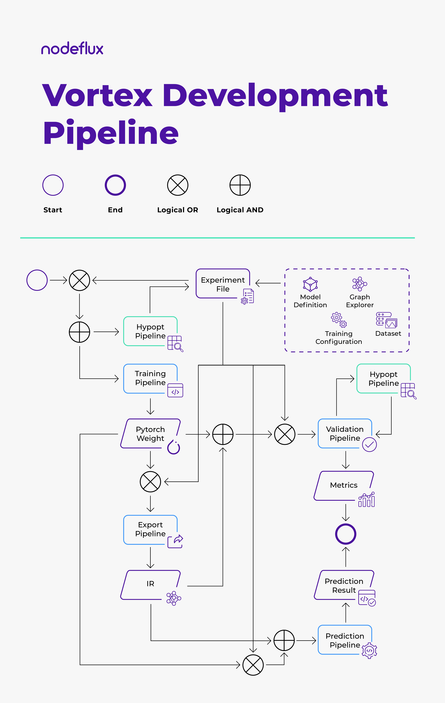

<p align='center'></p>

# Vortex Documentation

A Deep Learning Model Development Framework for Computer Vision

**Version : 0.1.0**

---

## Overview

Vortex (a.k.a Visual Cortex) is a computer deep learning framework based on Pytorch that provides end-to-end model development. It utilizes **a single experiment file** in YAML format (and an optional YAML file for hyperparameter optimization) to navigate all of the pipelines and provides complete development environment which consists of the following pipelines :

- [Training](user-guides/pipelines.md#training-pipeline)
- [Validation](user-guides/pipelines.md#validation-pipeline)
- [Prediction](user-guides/pipelines.md#prediction-pipeline)
- [Hyperparameters Optimization](user-guides/pipelines.md#hyperparameters-optimization-pipeline)



Additionally, it also support exporting Pytorch model into graph Intermediate Representation (IR) and utilize it on specific runtime by the following process :

- [Graph Export](user-guides/pipelines.md#graph-export-pipeline)
- [IR Validation](user-guides/pipelines.md#ir-validation-pipeline)
- [IR Prediction](user-guides/pipelines.md#ir-prediction-pipeline)

Currently we support deep learning model development on computer vision of the following task:

- Image Classification
- Object Detection ( **UNVERIFIED YET, MAY PRODUCE BAD RESULTS** )
    - Multiple Object Detection
    - Single Object Detection with Landmarks

---

## Highlights

- Easy CLI usage
- Modular design, reusable components
- Various architecture support
    - 50 + infamous backbone networks
    - Classification and Detection architecture support
- Integration with image augmentation library ( [Albumentations](https://albumentations.readthedocs.io/en/latest/) )
- Integration with hyperparameter optimization library ( [Optuna](https://optuna.org/) )
- Integration with 3rd party experiment logger ( [Comet.ml](https://www.comet.ml/site/) )
- Graph export to [Torchscript](https://pytorch.org/docs/stable/jit.html) and [ONNX](https://onnx.ai/)

---

## Installation

---

Currently this installation guide cover the installation of the following components:

- Vortex
- Vortex Runtime :
    - torchscript (backends : cpu,cuda )
    - onnxruntime (backends : cpu )

### On Host

Install package dependencies :

```console
apt update
apt install -y libsm6 libxext6 libxrender-dev ffmpeg \
               x264 libx264-dev libsm6 git sqlite3 \
               libsqlite3-dev graphviz pciutils
```

Vortex run and tested on Python 3.6, so if you use Ubuntu 18.04 just run :

```console
apt install -y python3 python3-pip
```

or, you can download the Python 3.6 release [here](https://www.python.org/downloads/release/python-369/)

And it's also better to update the pip package to avoid several installation issues

```console
pip3 install -U pip
```

Then, clone the repo and install the vortex package

```console
git clone https://github.com/nodefluxio/vortex.git
cd vortex
pip3 install '.'
```

Additionally if you want to install vortex with optuna visualization support :

```console
pip3 install '.[optuna_vis]'
```

This command will register a python package named as `visual-cortex` when you check it using `pip3 list`.

```console
pip3 list | grep visual-cortex

/*
visual-cortex            {installed-version}
*/
```

To check whether the installation is succesful, you can run :

```console
python3.6 -c 'import vortex'
```

Which will print output like this

```console
UserWarning: finished scanning dataset, available dataset(s) : 
{   'external': [],
    'torchvision.datasets': [   'MNIST',
                                'FashionMNIST',
                                'KMNIST',
                                'EMNIST',
                                'QMNIST',
                                'ImageFolder',
                                'CIFAR10',
                                'CIFAR100',
                                'SVHN',
                                'STL10']}
  (pp.pformat(all_datasets)))
```

---

### Using Docker

You can build the dockerfile,

```console
docker build -t vortex:dev -f dockerfile .
```

---

## Getting Started

Vortex utilizes a certain standard to allow seamless integration between pipelines. In this guide, we will show you how to **integrate your dataset/use the built-in ones**, how to build the **experiment file**, and how to utilize and propagate both items to all of Vortex pipelines.

---

### Developing Vortex Model

1. The first step is dataset integration, it is recommended for you to check the [built-in datasets section](modules/builtin_dataset.md) in order to find suitable setting for your dataset. For example, you can use [torchvision's ImageFolder](modules/builtin_dataset.md#torchvision-dataset) to integrate a classification dataset. However, if you didn't find any suitable internal integration, you can follow [dataset integration section](user-guides/dataset_integration.md) to make your own integration point

2. Next, we need to build the **experiment file**, please follow the [experiment file configuration section](user-guides/experiment_file_config.md)

3. At this point, you should've already prepared your **experiment file** and your **dataset**. You can now run the training pipeline. See [training pipeline section](user-guides/pipelines.md#training-pipeline) for further instructions.

4. After receiving Vortex model from training pipeline, you can either do :

    - measure your model's performance using [validation pipeline](user-guides/pipelines.md#validation-pipeline), or
    - directly use the model in your script using [prediction pipeline API](api/vortex.core.pipelines.md#pytorchpredictionpipeline), or
    - further optimize your model by converting it into Intermediate Representation using [graph export pipeline](user-guides/pipelines.md#graph-export-pipeline)

5. If you choose to export your model, once you have the Vortex IR model, you can either do :

    - measure your IR model's performance using [IR validation pipeline](user-guides/pipelines.md#ir-validation-pipeline), or
    - directly use the IR model in your script using [IR prediction pipeline API](api/vortex.core.pipelines.md#irpredictionpipeline)

---

### Hyperparameter Optimization

Now, once you've accustomed with Vortex pipelines, you can explore the use of hypopt pipeline to find the best hyperparameter setting for your model. Basically To do that, you can follow the guide below :

1. Prepare hyperparameter configuration file. You can check [hypopt config file section](user-guides/hypopt_file_config.md) to create it
2. Make sure all requirement related to [`objective`](user-guides/hypopt_file_config.md#objective) is already met. 

    For example, if you want to use `ValidationObjective` , you need to check whether you've already prepared the requirements of [validation pipeline](user-guides/pipelines.md#validation-pipeline)

3. Run the hypopt pipeline, see [hypopt pipeline section](user-guides/pipelines.md#hyperrparameters-optimization-pipeline)
4. Once you get the optimal hyperparameters value, you can use it with the corresponding pipeline


