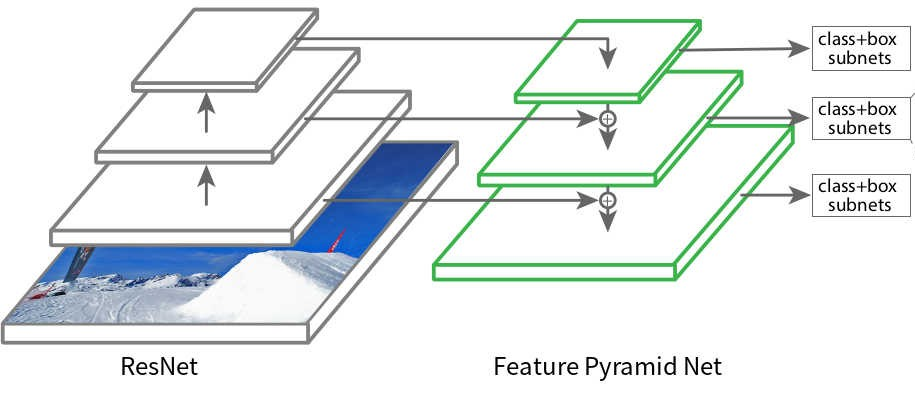

# Backbones Network

This section listed all available `backbone` configuration. Part of [`model.name` configurations](../user-guides/experiment_file_config.md#model) (if the model support it) in experiment file.

Backbones refers to the network which takes as input the image and extracts the feature map upon which the rest of the network is based. Usually, a famous image classification network is used as a backbone for other computer vision tasks, such as object detection. For example we can see figure below :

In the figure, Resnet is used as a backbone in the Feature Pyramid Network (FPN) model for object detection. In Vortex, we provide various backbone that can be combined in different models.

Backbones params and MAC/FLOPS comparison ( to compare which backbones is the lightest or heaviest ) can be found on this [spreadsheet link](https://docs.google.com/spreadsheets/d/1M18Bm08P983_-5diHXAmlUmHusjpHdYMmcN0FmrNS74/edit#gid=0)

**NOTES** :

- Params : total parameters in the model’s weight
- MAC / FLOPS : Multiply-Accumulate Operation / Floating Point Operations per Second

---

## Darknet

Variants from reference [YOLOv3: An Incremental Improvement](https://arxiv.org/abs/1804.02767) :

- `darknet53`

---

## EfficientNet

The pretrained model for EfficientNet base model `(b0 - l2)` is trained using Noisy Student, except for `b8`.

Variants from reference [EfficientNet: Rethinking Model Scaling for Convolutional Neural Networks](https://arxiv.org/abs/1905.11946) :

- `efficientnet_b0`
- `efficientnet_b1` 
- `efficientnet_b2` 
- `efficientnet_b3` 
- `efficientnet_b4` 
- `efficientnet_b5` 
- `efficientnet_b6` 
- `efficientnet_b7` 
- `efficientnet_b8` 

Variants from reference [Self-training with Noisy Student improves ImageNet classification](https://arxiv.org/abs/1911.04252) :

- `efficientnet_l2` 
- `efficientnet_l2_475`

Variants from reference [EfficientNet-EdgeTPU: Creating Accelerator-Optimized Neural Networks with AutoML](https://ai.googleblog.com/2019/08/efficientnet-edgetpu-creating.html) :

- `efficientnet_edge_s` 
- `efficientnet_edge_m` 
- `efficientnet_edge_l` 

Variants from reference [Higher accuracy on vision models with EfficientNet-Lite](https://blog.tensorflow.org/2020/03/higher-accuracy-on-vision-models-with-efficientnet-lite.html) :

- `efficientnet_lite0` 
- `efficientnet_lite1` 
- `efficientnet_lite2` 
- `efficientnet_lite3` 
- `efficientnet_lite4`

---

## MobileNet

Variants from reference [MobileNetV2: Inverted Residuals and Linear Bottlenecks](https://arxiv.org/abs/1801.04381) :

- `mobilenet_v2`

Variants from reference [Searching for MobileNetV3](https://arxiv.org/abs/1905.02244) :

- `mobilenetv3_large_075`
- `mobilenetv3_large_100`
- `mobilenetv3_large_minimal_100`
- `mobilenetv3_small_075`
- `mobilenetv3_small_100`
- `mobilenetv3_small_minimal_100`
- `mobilenetv3_rw`

---

## ResNet

Variants from reference [Deep Residual Learning for Image Recognition](https://arxiv.org/abs/1512.03385) :

- `resnet18` 
- `resnet34` 
- `resnet50` 
- `resnet101` 
- `resnet152`

Variants from reference [Aggregated Residual Transformations for Deep Neural Networks](https://arxiv.org/abs/1611.05431) :

- `resnext50_32x4d` 
- `resnext101_32x8d` 

Variants from reference [Wide Residual Networks](https://arxiv.org/abs/1605.07146) :

- `wide_resnet50_2`
- `wide_resnet101_2`

---

## ShuffleNet

Variants from reference [ShuffleNet V2: Practical Guidelines for Efficient CNN Architecture Design](https://arxiv.org/abs/1807.11164) :

- `shufflenetv2_x0.5`
- `shufflenetv2_x1.0` 
- `shufflenetv2_x1.5` 
- `shufflenetv2_x2.0` 

---

## VGG

Variants from reference [Very Deep Convolutional Networks for Large-Scale Image Recognition](https://arxiv.org/abs/1409.1556) :

- `vgg11` 
- `vgg11_bn` 
- `vgg13` 
- `vgg13_bn` 
- `vgg16` 
- `vgg16_bn` 
- `vgg19` 
- `vgg19_bn`