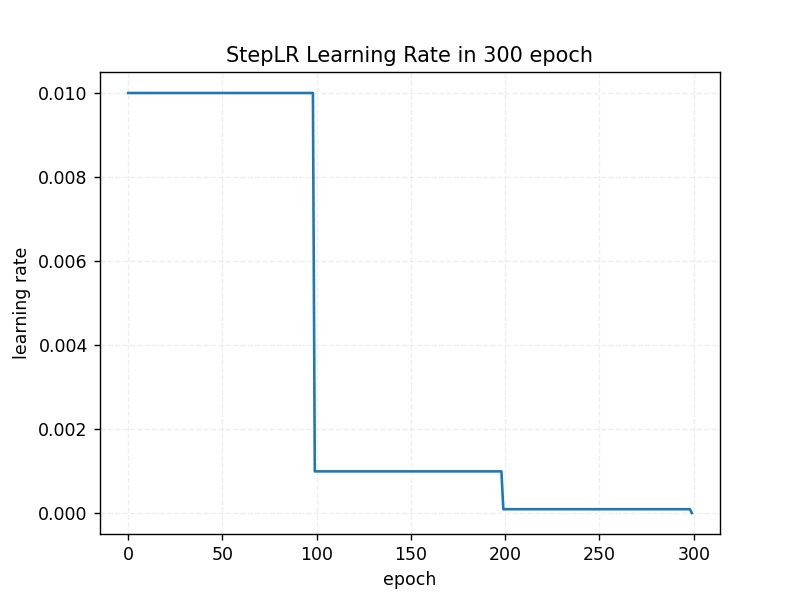
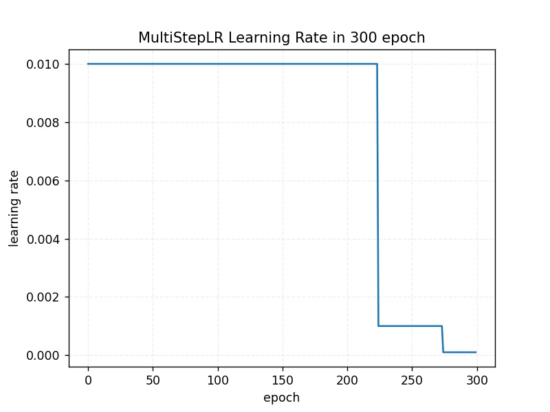
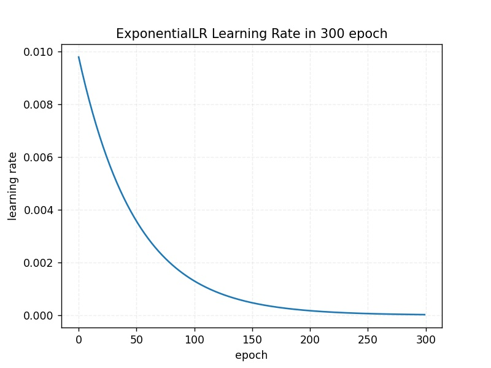
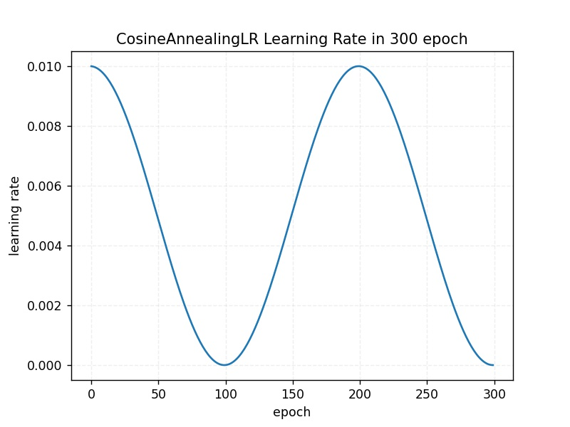
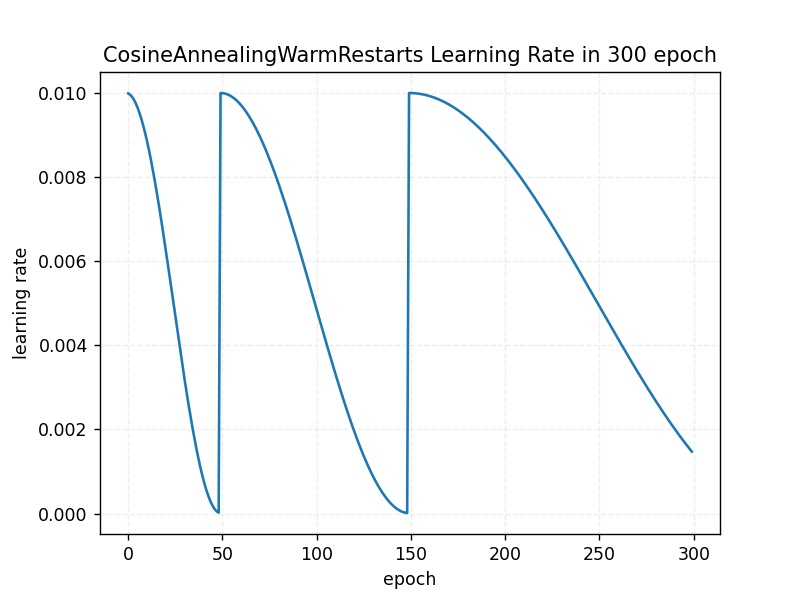
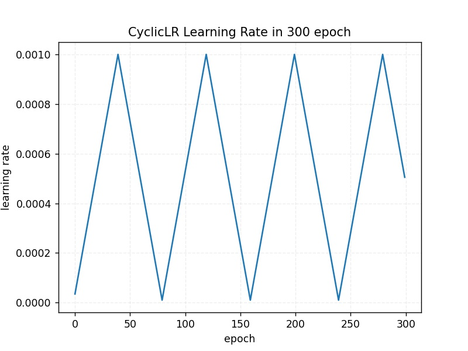
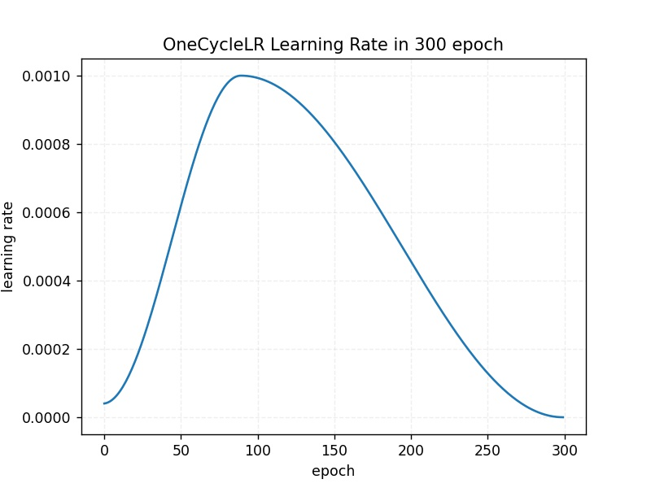
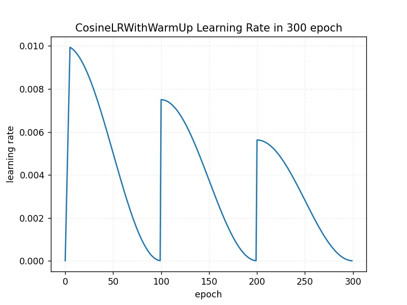
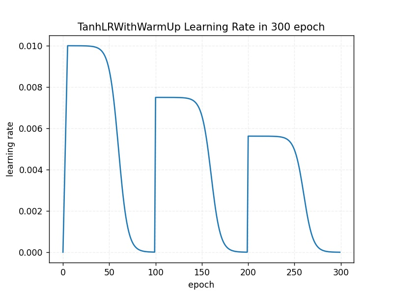
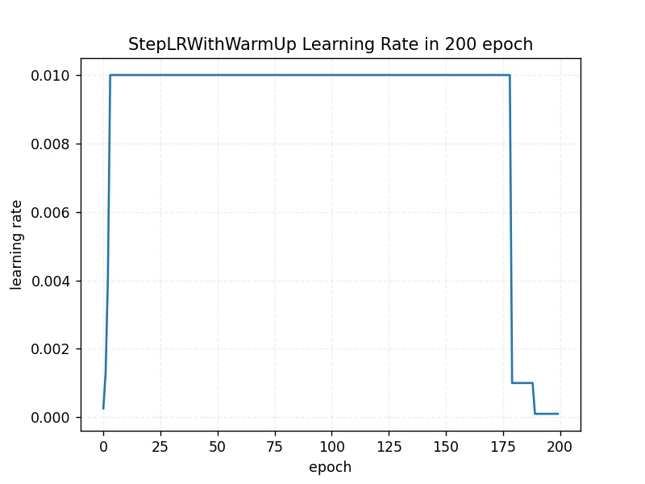

# Learning Rates Scheduler

This section listed all available `lr_scheduler` configuration. Part of [`trainer` configurations](../user-guides/experiment_file_config.md#trainer) in experiment file. 

Additionally, we have a utility script `scripts/visualize_learning_rate.py` on our repository to help user visualize their learning rate scheduler. 

```console
usage: visualize_learning_rate.py [-h] [-c CONFIG] [--epochs EPOCHS] [CFG]

Visualize learning rate scheduler

positional arguments:
  CFG                   experiment configuration file path (.yml)

optional arguments:
  -h, --help            show this help message and exit
  -c CONFIG, --config CONFIG
                        experiment configuration file path (choose either one
                        of this or positional argument)
  --epochs EPOCHS       number of epoch of learning rate to be calculated,
                        override epoxh in experiment file
```

E.g. :

```console
python3 scripts/visualize_learning_rate.py -c experiments/configs/shufflenetv2x100_retinaface_frontal_fddb_640.yml --epochs 300
```


---

## Pytorch Scheduler

Vortex support several Pytorch original scheduler implementation. User only need to specify the arguments beside the `optimizer` arguments which have already handled internally

---

### StepLR

[`StepLR` Documentation](https://pytorch.org/docs/stable/optim.html#torch.optim.lr_scheduler.StepLR)

E.g. :

```yaml
lr_scheduler: {
    method: StepLR,
    args: {
        step_size: 100,
        gamma: .1,
        last_epoch: -1
    }
},
```

Example Visualization :

Using above configuration, and epoch of 300,



---

### MultiStepLR

[`MultiStepLR` Documentation](https://pytorch.org/docs/stable/optim.html#torch.optim.lr_scheduler.MultiStepLR)

E.g. :

```yaml
lr_scheduler: {
    method: MultiStepLR,
    args: {
        milestones: [225,275],
        gamma: .1,
        last_epoch: -1
    }
},
```

Example Visualization :

Using above configuration, and epoch of 300,



---

### ExponentialLR

[`ExponentialLR` Documentation](https://pytorch.org/docs/stable/optim.html#torch.optim.lr_scheduler.ExponentialLR)

E.g. :

```yaml
lr_scheduler: {
    method: ExponentialLR,
    args: {
        gamma: .98,
        last_epoch: -1
    }
},
```

Example Visualization :

Using above configuration, and epoch of 300,



---

### CosineAnnealingLR

[`CosineAnnealingLR` Documentation](https://pytorch.org/docs/stable/optim.html#torch.optim.lr_scheduler.CosineAnnealingLR)

E.g. :

```yaml
lr_scheduler: {
    method: CosineAnnealingLR,
    args: {
        T_max: 100,
        eta_min: 0.00001,
        last_epoch: -1
    }
},
```

Example Visualization :

Using above configuration, and epoch of 300,



---

### CosineAnnealingWarmRestarts

[`CosineAnnealingWarmRestarts` Documentation](https://pytorch.org/docs/stable/optim.html#torch.optim.lr_scheduler.CosineAnnealingWarmRestarts)

E.g. :

```yaml
lr_scheduler: {
    method: CosineAnnealingWarmRestarts,
    args: {
        T_0: 50,
        T_mult: 2,
        eta_min: .00001,
        last_epoch: -1
    }
},
```

Example Visualization :

Using above configuration, and epoch of 300,



---

### CyclicLR

[`CyclicLR` Documentation](https://pytorch.org/docs/stable/optim.html#torch.optim.lr_scheduler.CyclicLR)

E.g. :

```yaml
lr_scheduler: {
    method: CyclicLR,
    args: {
        base_lr: 0.00001,
        max_lr: 0.001,
        step_size_up: 2000,
        mode: triangular,
        gamma: 1.0,
        last_epoch: -1
    }
},
```

Example Visualization :

Using above configuration, and epoch of 300,



---

### OneCycleLR

[`OneCycleLR` Documentation](https://pytorch.org/docs/stable/optim.html#torch.optim.lr_scheduler.OneCycleLR)

E.g. :

```yaml
lr_scheduler: {
    method: OneCycleLR,
    args: {
        max_lr: 0.001,
        steps_per_epoch: 200,
        epochs: 300,
        pct_start: .3,
        anneal_strategy: cos,
        last_epoch: -1
    }
},
```

Example Visualization :

Using above configuration, and epoch of 300,



---

## Custom Implementation

---

### CosineLR With Warm Up

Implement Cosine decay scheduler with warm restarts

Reference : 

- [SGDR: Stochastic Gradient Descent with Warm Restarts](https://arxiv.org/abs/1608.03983)
- [allennlp/cosine.py](https://github.com/allenai/allennlp/blob/master/allennlp/training/learning_rate_schedulers/cosine.py)

```yaml
lr_scheduler: {
    method: CosineLRWithWarmUp,
    args: {
        t_initial: 100,
        t_mul: 1.0,
        lr_min: 0.00001,
        warmup_lr_init: 0.00001,
        warmup_t: 5,
        cycle_limit: 3,
        t_in_epochs: True,
        decay_rate: 0.75,
    }
},
```

Arguments : 

- `t_initial` (int) : the number of iterations (epochs) within the first cycle
- `t_mul` (float) : determines the number of iterations (epochs) in the i-th decay cycle, which is the length of the last cycle multiplied by `t_mul`. default : 1
- `lr_min` (float) : minimum learning rate after decay. default : 0.
- `warmup_lr_init` (float) : starting learning rate on warmup stage. default : 0
- `warmup_t` (int) : number of epoch of warmup stage. default : 0
- `cycle_limit` (int) : number of cosine cycle. default : 0
- `t_in_epochs` (bool) : if True, update learning rate per epoch, if not, update per step. default : True
- `decay_rate` (float) : learning rate decay rate. default : 1

Example Visualization :

Using above configuration, and epoch of 300,



---

### TanhLR With Warm Up

Implement Hyperbolic-Tangent decay with warm restarts

Reference :

- [Stochastic Gradient Descent with Hyperbolic-Tangent Decay on Classification](https://arxiv.org/abs/1806.01593)

```yaml
lr_scheduler: {
    method: TanhLRWithWarmUp,
    args: {
        t_initial: 100,
        t_mul: 1.0,
        lb: -6.,
        ub: 4.,
        lr_min: 0.00001,
        warmup_lr_init: 0.00001,
        warmup_t: 5,
        cycle_limit: 3,
        t_in_epochs: True,
        decay_rate: 0.75,
    }
}
```

Arguments : 

- `t_initial` (int) : the number of iterations (epochs) within the first cycle
- `t_mul` (float) : determines the number of iterations (epochs) in the i-th decay cycle, which is the length of the last cycle multiplied by `t_mul`. default : 1
- `lb` (float) : tanh function lower bound value
- `ub` (float) : tanh function upper bound value
- `lr_min` (float) : Minimum learning rate after decay. default : 0.
- `warmup_lr_init` (float) : starting learning rate on warmup stage. default : 0
- `warmup_t` (int) : number of epoch of warmup stage. default : 0
- `cycle_limit` (int) : number of cosine cycle. default : 0
- `t_in_epochs` (bool) : if True, update learning rate per epoch, if not, update per step. default : True
- `decay_rate` (float) : learning rate decay rate. default : 1

Example Visualization :

Using above configuration, and epoch of 300,



---

### StepLR With Warm Up

Implement StepLR scheduler with burn in (warm start), adapted from YOLOv3 training method

Reference : 

- [DeNA/PyTorch_YOLOv3: Implementation of YOLOv3 in PyTorch](https://github.com/DeNA/PyTorch_YOLOv3)

```yaml
lr_scheduler: {
    method: StepLRWithWarmUp,
    args: {
        warm_up: 5,
        steps: [180,190],
        scales: [.1,.1],
        last_epoch: -1
    }
}
```

Arguments :

- `warm_up` (int) : number of epochs for warm up
- `steps` (list) : list of epoch when the learning rate will be reduced, e.g. [180,190] --> learning rate will be reduced on epoch 180 and epoch 190
- `scales` (list) : scale of the reduced learning rate, e.g. [0.1,0.1] --> e.g. initial lr == 0.01 , on epoch 180 will be reduced to 0.1 * 0.01 = 0.001 and on epoch 190 will be reduced to 0.1 * 0.001 = 0.0001
- `last_epoch` (int) : last epoch number. default : -1

Example Visualization :

Using above configuration, and epoch of 200,


