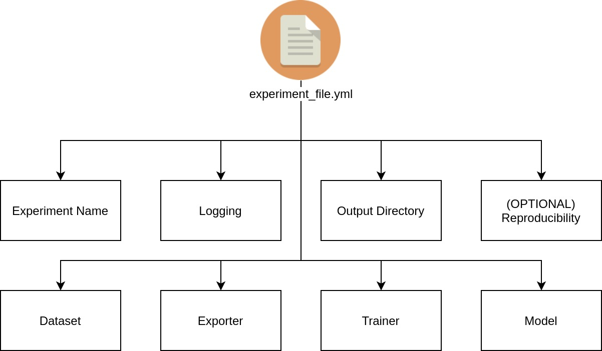

# Experiment File Configuration

A YAML experiment file is needed to navigate all of Vortex pipelines. This experiment file will contain and track all configurations during all pipelines and can be a single source of information on how a model is developed. Several examples of experiment file can be inspected on [this link](https://github.com/nodefluxio/vortex/tree/master/experiments/configs). In this guide, we will cover all available sections that can be configured.



---

All available configurations is listed below :

## Experiment Name

Flagged with `experiment_name` key (str) in the experiment file. This field acts as an experiment identifier and is related to the experiment output directory where the trained model,reports, backups,and etc. will be dumped. E.g. :

```yaml
experiment_name: shufflenetv2x100_softmax_cifar10
```

---

## Logging

Flagged with `logging` key (dict or str(`None`)) in the experiment file. This field denotes logging providers that can be used for experiment logging, such as tensorboard, comet-ml, etc. The supported logging provider listed in the [logging provider section](../modules/logging_provider.md). E.g. :

```yaml
logging: {
    module: comet_ml,
    args: {
        api_key: HGhusyd76hsGiSbt27688,
        project_name: vortex-classification,
        workspace: hyperion-rg
    },
    pytz_timezone: Asia/Jakarta
}
```

Arguments :

- `module` (str) : denotes a specific logging provider module
- `args` (dict) : the corresponding arguments for selected `module`
- `pytz_timezone` (str) : the setting of the recorded experiment run timezone in Vortex local system. All timezone settings can be found in [this link](https://gist.github.com/heyalexej/8bf688fd67d7199be4a1682b3eec7568)

---

## Output Directory

Flagged with `output_directory` key (str) in the experiment file. This configuration set the location where experiment's output directory will be created. E.g. :

```yaml
output_directory: experiments/outputs
```

---

## Device

Flagged with `device` key (str) in the experiment file. This configuration set device to run experiment. E.g. :

```yaml
device: 'cuda:0'
```

Arguments :

- `device` (str) : set the device to run the experiment in pipelines, whether using CPU `cpu` or cuda GPU `cuda`. To use specific GPU device, append `:{i}` to `cuda`, E.g. `cuda:0` for GPU index 0, `cuda:1` for GPU index 1

---

## Reproducibility and cuDNN auto-tune

**THIS CONFIGURATION IS OPTIONAL (MAY IMPACT TRAINING PERFORMANCE)**


Flagged with `seed` key (dict) in the experiment file. This configuration setting can be set if the user wants a model training experiment reproducibility. However as noted in [this reference](https://pytorch.org/docs/stable/notes/randomness.html), completely reproducible results are not guaranteed across PyTorch releases, individual commits or different platforms, even with identical seeds. However we still can make the computation deterministic, to produce similar results. For further information, you can check [this link](https://pytorch.org/docs/stable/notes/randomness.html). E.g. :

```yaml
seed: {
    torch: 0,
    numpy: 0,
    cudnn: {
        deterministic: True,
        benchmark: False,
    }
}
```

Arguments : 

- `torch` (int) : set the Pytorch seed
- `numpy` (int) : set the Numpy seed
- `cudnn` (dict) : cuDNN configurations, sub-arguments :

    - `deterministic` (bool) : set the Pytorch computation to be deterministic
    - `benchmark` (bool) : set the cuDNN auto-tuner

The `cudnn` args only need to be specified if the user trains using NVIDIA GPU (CuDNN backend). Additionally, by using this seed configuration you also use cuDNN auto-tune capability by using the following configuration

```yaml
seed: {
    cudnn: {
        benchmark: True,
    }
}
```

---

## Dataset

Flagged with `dataset` key (dict) in the experiment file. This is the configurations of the dataset to be used in the pipeline, which includes the dataset name for `train` and `eval` dataset. E.g. :

```yaml
dataset: {
    train: {
        name: VOC0712DetectionDataset,
        args: {
            image_set: train,
        },
        augmentations: [
        {
            module: albumentations,
            args: {
                transforms: [
                    { transform: HorizontalFlip, args: { p: 0.5}},
                ],
                bbox_params: {
                    min_visibility: 0.0,
                    min_area: 0.0
                },
                visual_debug: False
            }
        },
        # Example if you want to add another augmentation module
        # {
        #     module: imgaug, # NOTES : `imgaug` module is not implemented yet, just example
        #     args: {
        #         transforms: []
        #     }
        # }
        ]
    },
    eval: {
        name: VOC0712DetectionDataset,
        args: {
            image_set: val
        }
    },
}
```

Arguments :

- `train` AND `eval` (str) (`eval` is Optional): denotes the configuration of training and validation dataset respectively, if `eval` is not provided, in-loop validation process will be skipped. `eval` is mandatory for validation pipeline. Sub-arguments :

    - `dataset` (str) : the dataset class names which will be used, mentioned in [getting started section](../index.md#getting-started) step 1.
    - `args` (dict) : the corresponding arguments to the respective `dataset` class initialization
    - `augmentations` (list[dict]) (`train` only) : the augmentation configurations for training dataset. Augmentation modules provided in the list will be executed sequentially. sub-arguments (list members as dict) :

        - `module` (str) : selected augmentation module, see [augmentation module section](../modules/augmentation.md) for supported augmentation modules
        - `args` (dict) : the corresponding arguments for selected `module`

---

## Data Loader

Flagged with `dataloader` key (dict) in the experiment file. This is the configurations of dataloader to be used in the training. E.g. :

```yaml
dataloader: {
    module: PytorchDataLoader,
    args: {
        num_workers: 0,
        batch_size: 16,
        shuffle: True,
    },
}
```

Arguments :

- `dataloader` (dict) : denotes the configuration of the dataset iterator

    - `module` (str) : specify the dataloader module to be used, supported data loader modules is provided at [data loader module section](../modules/data_loader.md)
    - `args` (dict) : the corresponding arguments for selected `module`

---

## Trainer

Flagged with `trainer` key (dict) in the experiment file. This configuration set how we train and several other configurations related to training iterations. E.g. :

```yaml
trainer: {
    optimizer: {
        method: SGD,
        args: {
            lr: 0.001,
            momentum: 0.9,
            weight_decay: 0.0005
        }
    },
    lr_scheduler: {
        method: CosineLRWithWarmUp,
        args: {
            t_initial: 200,
            t_mul: 1.0,
            lr_min: 0.00001,
            warmup_lr_init: 0.00001,
            warmup_t: 3,
            cycle_limit: 1,
            t_in_epochs: True,
            decay_rate: 0.1
        }
    },
    epoch: 200,
    save_epoch: 1,
    save_best_metrics: [loss,mean_ap],
    save_last_epoch: True,
    driver: {
        module: DefaultTrainer,
        args: {
            accumulation_step: 4,
        }
    }
}
```

Arguments :

- `optimizer` (dict) : configuration for optimization algorithm. Sub-arguments :

    - `method` (str) : optimization method identifier, currently support all optimizers supported by Pytorch listed in [this link](https://pytorch.org/docs/stable/optim.html#algorithms)
    - `args` (dict) : the corresponding arguments to the respective optimizer `method`

- `lr_scheduler` (dict) : methods to adjust the learning rate based on the number of epochs

    - `method` (str) : scheduler method identifier, supported scheduler methods is provided at [learning rate scheduler section](../modules/scheduler.md)
    - `args` (dict) : the corresponding arguments to the respective scheduler `method`

- `epoch` (int) : number of dataset iteration (epoch) being done on the training dataset. 1 epoch is 1 dataset iteration
- `save_epoch` (int, optional) : number of epoch before a model checkpoint being saved for backup.
- `save_last_epoch` (bool, optional) : save last epoch model, this is useful when you are planning to resume training later on but doesn't want to use `save_epoch`.
- `save_best_metrics` (str, list, optional) : list of metrics or single metrics name to be monitored to save the best weight. Available options:

    - `loss` : per-epoch training loss

    For detection task :

    - `mean_ap` : validation mean-average precision metrics
    
    For classification task :

    - `accuracy` : validation accuracy metrics
    - `precision (micro)` : validation micro-average precision metrics
    - `precision (macro)` : validation macro-average precision metrics
    - `precision (weighted)` : validation weighted-average precision metrics
    - `recall (micro)` : validation micro-average recall metrics
    - `recall (macro)` : validation macro-average recall metrics
    - `recall (weighted)` : validation weighted-average recall metrics
    - `f1_score (micro)` : validation micro-average f1_score metrics
    - `f1_score (macro)` : validation macro-average f1_score metrics
    - `f1_score (weighted)` : validation weighted-average f1_score metrics

- `driver` (dict) : the mechanism on how a training is done in a loop ( iterated over `n` epochs ). Sub-arguments :

    - `module` (str) : training driver identifier. Supported training driver methods is provided at [training driver section](../modules/train_driver.md)
    - `args` (dict) : the corresponding arguments to the respective training driver `module`

---

## Validator

Flagged with `validator` key (dict) in the experiment file. This configuration set the validation process in the training iteration. E.g. :

```yaml
validator: {
    args: {
        score_threshold: 0.9,
        iou_threshold: 0.2,
    },
    val_epoch: 10
}
```

Arguments :

- `args` (dict) : additional arguments needed for validation process, including but not limited to arguments for model postprocessing which dependent on the model itself. For example :

    - For several detection models ( if needed ):

        - `score_threshold` (float) : threshold applied to the model’s predicted object confidence score. Only objects with prediction scores higher than this threshold will be considered true objects, else considered as background.

        - `iou_threshold` (float) : threshold for non-maxima suppression (NMS) intersection over union (IoU)

    - For classification :

        No additional arguments for this task, you can leave `args` with empty dict `{}`

- `val_epoch` (int) : periodic number of epoch when the validation process will be executed in the training loop

---

## Model

Flagged with `model` key (dict) in the experiment file. This configuration set the selected deep learning model architecture for the specific task. E.g. :

```yaml
model: {
    name: FPNSSD,
    preprocess_args: {
        input_size: 512,
        input_normalization: {
            mean: [ 0.5, 0.5, 0.5 ],
            std: [ 0.5, 0.5, 0.5 ],
            scaler: 255
        }
    },
    network_args: {
        backbone: shufflenetv2_x1.0,
        n_classes: 20,
        pyramid_channels: 256,
        aspect_ratios: [ 1, 2., 3. ],
        pretrained_backbone: True,
    },
    loss_args: {
        neg_pos: 3,
        overlap_thresh: 0.5,
    },
    postprocess_args: {
        nms: True,
    }
}
```

Arguments :

- `name` (str) : model name identifier. List of supported models can be found in [models zoo section](../modules/models_zoo.md). E.g. :
- `preprocess_args` (dict) : configurations for input data preprocessing. Sub-arguments :

    - `input_size` (int) : input data size, input image will be resized to square while maintaining aspect ratio, by padding the data with black pixel (0,0,0)
    - `input_normalization` (dict) : determine how input data will be normalized. Input data will be divided by `scaler` value accross all channel i.e. `output = input / scaler`. Then, given `mean`: `[M1,...,Mn]` and `std`: `[S1,..,Sn]` for `n` channels, this transform will normalize each channel of the input `torch.*Tensor` i.e. `output[channel] = (input[channel] - mean[channel]) / std[channel]`
        - `mean` (list) : sequence of means for each channel.
        - `std` (list) : sequence of standard deviations for each channel.
        - `scaler` (list) : scale value for each pixel, default = 255

- `network_args` (dict) : configuration related to the models architecture hyperparameter correspond to the respective model `name` identifier
- `loss_args` (dict) : configuration related to loss calculation hyperparameter which will be used in the training pipeline, which correspond to the respective model `name` identifier
- `postprocess_args` (dict) : configuration related to postprocess arguments, which correspond to the respective model `name` identifier

---

## Checkpoint

Flagged with `checkpoint` key (str) in the experiment file. This configuration describe the path to Vortex model checkpoint which will be used for continue interrupted training or transfer learning to different cases with same model configuration. E.g. :

```yaml
checkpoint: experiments/outputs/shufflenetv2x100_fpn_ssd_voc2007_512/16575bd31b364539817177ca14147b5d/shufflenetv2x100_fpn_ssd_voc2007_512-epoch-10.pth
```

---

## Graph Exporter

Flagged with `exporter` key (list or dict) in the experiment file. This configuration describe the graph exporter which will be used to convert the Pytorch graph into Intermediate Representation (IR) format. To export graph into multiple IR, use list of dict configurations. E.g. :

Single IR `exporter` :

```yaml
exporter: {
    module: onnx,
    args: {
        opset_version: 11,
    },
}
```

Multiple IR `exporter` :

```yaml
exporter: [
{
    module: onnx,
    args: {
        opset_version: 11,
    },
},
{
    module: torchscript,
    args: {},
},
]
```

Arguments :

- `module` (str) : selected exporter module, see [exporter section](../modules/exporter.md) for supported exporter modules
- `args` (dict) : the corresponding arguments to the respective exporter `module`
